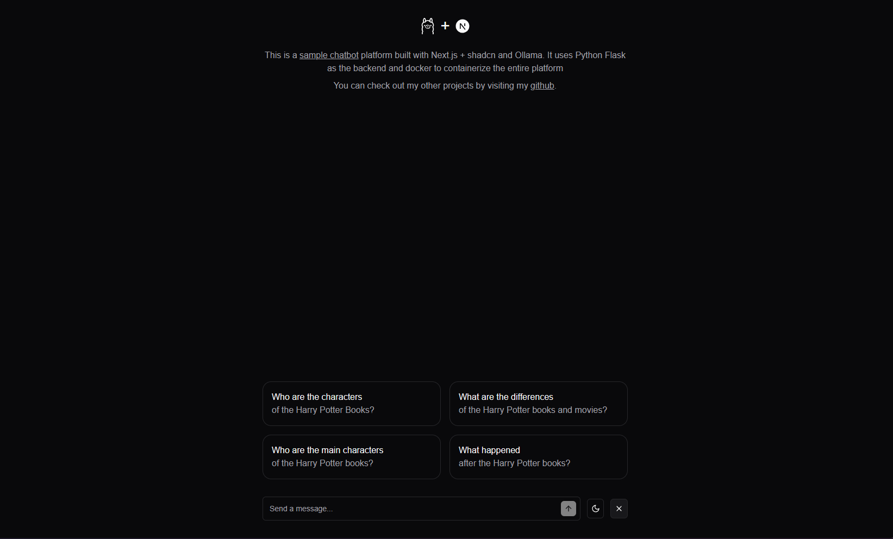

# Self-Hosting an LLM with Ollama and Llama 3.2

<p align="center">Inspiration from <a href="https://chat.vercel.ai/">chat.vercel.ai</a></p>

## About

This project provides a comprehensive template for self-hosting a Large Language Model (LLM) using Ollama with Llama 3.2. It is designed for developers who want to build and deploy AI-powered applications with a modern web interface and a scalable backend.

The project includes:

- A **Next.js frontend** with Shadcn for a sleek and responsive UI.
- A **Flask backend** that leverages LangChain for efficient LLM function handling.
- **Session-based chat history**, allowing users to maintain context across multiple interactions.
- **Modular architecture**, making it easy to extend and customize for different use cases.adFeatures
- **PostgreSQL database support**, managed via Docker Compose for easy setup.

## Prerequisites

Ensure you have the following installed before proceeding:

- [Node.js](https://nodejs.org/) (for npm)
- [Python](https://www.python.org/)
- [Ollama](https://ollama.com/) (for running Llama 3.2)
- [Docker](https://www.docker.com/) (for running PostgreSQL via Docker Compose)

---

## Features

- **Chat History Management**: Utilizes LangChain with session IDs for multiple chat sessions.
- **Modern UI**: Built with Next.js and Shadcn for a seamless user experience.
- **Modular Architecture**: Designed for easy customization and extension.
- **PostgreSQL Database**: Managed via Docker Compose to store chat sessions efficiently.

---

## Customization
- Model to use: `backend/.env`
```bash
OLLAMA_MODEL=[put here desired model to use]
```
```bash
ollama pull [pick a specific model that ollama supports]
```
- System Prompt: `backend/utils/chat.py`
```python
system_prompt="""
[put here your own custom prompt]
"""
```
---

## Installation and Usage

### Ollama Setup

1. **Install Ollama** by following the instructions on [Ollama's official site](https://ollama.com/).
2. **Download the Llama 3.2 model**:
   ```sh
   ollama pull llama3.2
   ```
3. **Start the Ollama server**:
   ```sh
   ollama serve
   ```

### Backend Setup

1. **Set up a Python virtual environment** and install dependencies:
   ```sh
   cd backend
   python -m venv venv
   source venv/bin/activate   # On Windows, use `venv\Scripts\activate`
   pip install -r requirements.txt
   ```
2. **Configure Environment Variables**:
   - Copy the example file and update values as needed:
     ```sh
     cp .env.example .env
     ```
3. **Run the PostgreSQL Database using Docker Compose**:
   ```sh
   docker-compose up -d
   ```
4. **Run the Backend**:
   ```sh
   python app.py
   ```
   *For production, consider using **`wsgi.py`** or setting up a proper WSGI server.*

### Frontend Setup

1. **Navigate to the frontend directory**:
   ```sh
   cd frontend
   ```
2. **Install dependencies**:
   ```sh
   npm install
   ```
3. **Configure Environment Variables**:
   ```sh
   cp .env.example .env
   ```
4. **Run the Frontend**:
   - For development:
     ```sh
     npm run dev
     ```
   - For production:
     ```sh
     npm run build
     npm start
     ```

---

## Project Structure

```
project-root/
│── backend/
│   │── .env
│   │── .env.example
│   │── .gitignore
│   │── app.py
│   │── docker-compose.yml
│   │── flask_session/
│   │── requirements.txt
│   │── utils/
│   │── venv/
│
│── frontend/
│   │── .env
│   │── .env.example
│   │── .eslintrc.json
│   │── .gitignore
│   │── .next/
│   │── app/
│   │── components/
│   │── components.json
│   │── lib/
│   │── next-env.d.ts
│   │── next.config.mjs
│   │── package.json
│   │── postcss.config.mjs
│   │── README.md
│   │── tailwind.config.ts
│   │── tsconfig.json
```

### Notable Files and Directories

#### Backend

- **`app.py`**: Main Flask application entry point.
- **`requirements.txt`**: Lists the Python dependencies.
- **`utils/`**: Contains utility modules for the backend.
- **`.env.example`**: Example environment configuration file.
- **`docker-compose.yml`**: Configuration file for running PostgreSQL using Docker Compose.

#### Frontend

- **`package.json`**: Defines npm dependencies and scripts.
- **`next.config.mjs`**: Configuration file for Next.js.
- **`components/`**: Contains reusable React components.
- **`lib/`**: Utility functions for the frontend.
- **`.env.example`**: Example environment configuration file.

---

## Contributing

If you would like to contribute, please feel free to submit a pull request or open an issue.

## License

This project is licensed under the MIT License. See `LICENSE` for details.

---

### Acknowledgments

- [Ollama](https://ollama.com/)
- [LangChain](https://python.langchain.com/)
- [Next.js](https://nextjs.org/)
- [Shadcn](https://shadcn.dev/)

